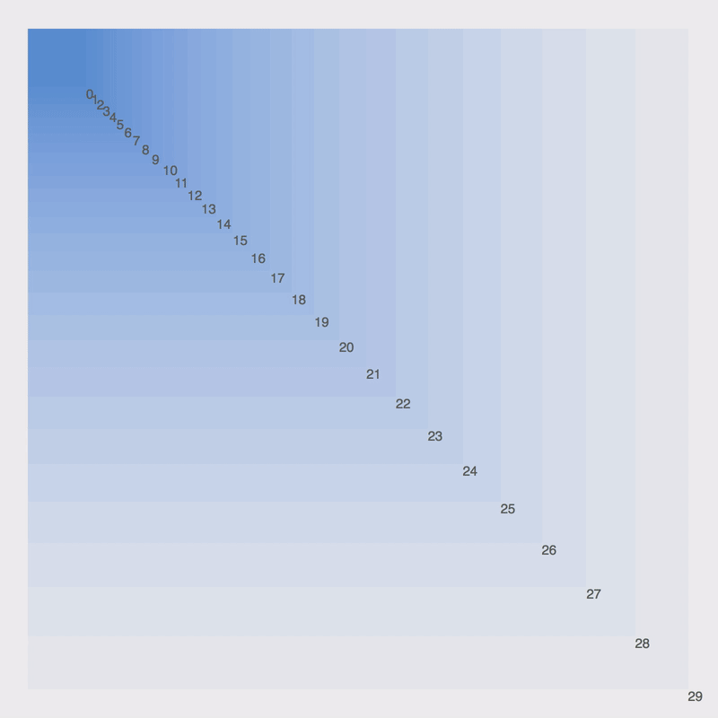
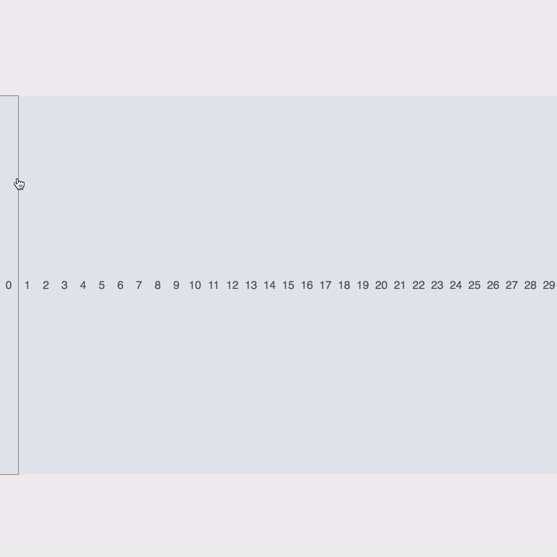

## The Portal API

React 16 landed with a helpful <a href="https://reactjs.org/docs/portals.html" target="_blank" rel="noreferrer">new API</a> called *portals* which is a first-class way of rendering children into a DOM node outside of the parent component’s hierarchy. Before 16 you had to provide your own solution for breaking outside of this hierarchy – now it’s just as simple as calling:

```tsx
ReactDOM.createPortal(<Component>, domNode);
```

Yup, just pass a \`\<Component>\` you’d like to render and *any* valid HTML DOM node that you’d like React to render the component into.

## So what, who cares? 🤔 Why is this helpful?

The main reason the Portal API is useful is to escape inherited styles of parent DOM nodes – think z-index, overflow and position – and provide a way to render “outside” of the current component hierarchy. Before Portals, this was somewhat tricky…

As you may know, data in React naturally flows downward from parent to child so it’s completely normal to end up with nested components that are logically related to their ancestors. But we may find ourselves in a situation where the parent DOM element has some styles that impact the child elements and the only way to avoid these effects was to move that component outside of the parent.

Seems simple enough, but what if the state and context of the child are closely coupled with the parent component? Well, then you’ll have to start communicating between the two. This can also be accomplished a number of ways such as with a prop functions or using actions from a state management library like Redux, or even using a third party portal implementations.

All solutions have drawbacks: Prop callbacks can get old really fast if you’ve “drilled” to deep, state libraries can be overly complex for a simple React project and is an extra dependency, and third party portals obviously aren’t built in and are also another dependency.

Enter the magic 🔮 of native Portals! Instead of moving the component we can “transport” it through a portal to render into a DOM node of our choosing. We’ll still be rendering in the same context and have access to all the parent props/state/data we may need but we’ll also be able to escape any parent styles that were proving problematic for our design.

<a href="https://codepen.io/jscottsmith/pen/xYaawK"></a>

See the live <a href="https://codepen.io/jscottsmith/pen/xYaawK">CodePen</a>

### **How the Portal Works**

The button to toggle the portal on and off illustrates the issue of overflow and why the portal is helpful in this case. When the portal is enabled React is directed to render my **\<ContextMenu>** outside of the **\<Window>**. Specifically, it is told to render it into the body of the HTML document at **\<div id="context-menu">\</div>**. This allows it to appear as a global UI element while still remaining logically nested within the component hierarchy.

Checkout what the ContextMenu is returning and you’ll see a call to createPortal where the argument menu is the markup, and portalEl is the **#context-menu** DOM element (the ternary exists so I can toggle it on and off in the demo):

```js
return portalEl ? ReactDOM.createPortal(menu, portalEl) : menu;
```

So the portal in this example allows us to keep the **\<ContextMenu>** close to the relevant application state which the **\<Artboard>** is managing and avoids us having to move it to the root of our application and devise a way of communicating between the two. No prop functions or flux/redux to pass around state, just a native portal to transport our DOM markup to where it’s needed.

## Escaping Positioning

Sometimes the necessary positioning a parent can cause limitations when positioning a child. Another perfect use case for a Portal.

Let’s make a dumb chat bot, that allows us to chat using emoji with shortcodes like **:robot:** 🤖 or **:smile:** 😀. Here’s the main things it will do:

- Allow users to type into a message box that automatically searches for potential emoji shortcodes.
- Display a menu of those potentially matching emoji to select an insert into the message.
- Allow tab to autocomplete with the first matching emoji.
- Send and display a message in the chat.

Problems the Portal solves:

- Allows us to escape the absolute positioning of the **\<TextInput>** and position the menu relative to the **\<Chat>** window, without relocating the component outside the parent.

The code will be slightly more complex since there’s more features but the solution involving portals is just as simple as before so I’ll only cover that.

This time, since I’m not going to to be positioning the element globally so I won’t use an element at the document body like before. This time I’ll use a ref function **ref=\{ref => (this.header = ref)\}** to get a reference to the DOM element and I’ll pass another **function getRef=\{() => this.header\}** to my **\<TextInput>** that retrieves the necessary ref. This allows me to get the DOM element that will contain the portal. Since this DOM node will be managed by React we should make sure it will always be available when needed and not potentially unmounted. See the render method of **\<App>**.

```tsx
{/* the portal el */}
<header ref={ref => (this.header = ref)} />
<Chat comments={this.state.comments} />
<TextInput
    handleSubmit={this.handleSubmit}
    getRef={() => this.header} // this will allow us to retrieve the ref for creating the portal
/>
```

Now that we have a reference to the element we can create the portal. I’ve set up my **\<TextInput>** component to show the emoji menu when a potential shortcode is found. Once that state is **true** we create and render into our portal:

```tsx
<div className="text-input">
    <textarea />
    {showEmoji &&
        ReactDOM.createPortal(
            <EmojiMenu />,
            this.props.getRef() // the header element that exists outside this component
        )}
</div>
```

That’s really it. Again, it’s incredibly simple to setup and now we’re rendering part of our component markup into another DOM node (this time a node managed by React) outside of the parent.

<a href="https://codepen.io/jscottsmith/pen/rJXwLd"></a>

Here’s the <a href="https://codepen.io/jscottsmith/pen/rJXwLd">Demo</a>; type in the text area, insert a \`**:\`** and the shortcode name to see the menu pop up.

See the <a href="https://codepen.io/jscottsmith/pen/rJXwLd">CodePen</a>

As you can see in the demo a menu will pop up at the top of the window even though our component is located within another component. Cool, now let’s look at something else.

## Portal Event Bubbling

One interesting and sometimes unanticipated behaviors of portals is that event bubbling behaves as though the event is bubbling through the React component’s hierarchy and *NOT* the DOM hierarchy. Here’s a quick example of what this means.

A simple app with portal structure:

```tsx
<App onClick={appClicks}>
    <Portal>
        <button onClick={buttonClicks}>
            Click me
        </button>
    </Portal>
</App>
```

Here’s the markup **\<App>** will produce:

```tsx
<div id="app"><div>
<div id="portal">
    <button>Click me<button>
</div>
```

Notice that the **#portal** isn’t a child of **#app** so we wouldn’t expect an event from the portal to bubble to the app.

However, when clicking the **\<button>** inside the portal the event *will* bubble up through the portal into the **\<App>** and call any click handlers along the way. This can feel odd since the HTML hierarchy doesn’t represent our React component hierarchy, thus the bubbling up to the App would seem odd. But these are *synthetic* events native to React, not actual events in the DOM. To prevent this we can simple call **event.stopPropagation()** on the button click handler. Just don’t forget about this behavior as there’s the potential of introducing minor bugs by forgetting about this.

Depending on the complexity of what you are doing with portals you may encounter more issues with this bubbling. There’s some interesting discussion taking place by React team members regarding <a href="https://github.com/facebook/react/issues/11387" target="_blank" rel="noreferrer">portal bubbling</a>.

## Portal Event Demo

To further illustrate this in a fun way I’ve setup more demos!

In each I’ll recursively render a component into itself that captures and runs an animation on click events. The first demo renders with React normally so we get a deeply nested tree of HTML. The second renders into a portal that is attached to the body of the HTML document so we end up with a flat HTML structure.

Recursive component that renders itself and a given component, until the depth is 0:

```tsx
const Recursive = ({ children, depth, component: Component }) => (
    depth > 0 &&
        <Component depth={depth - 1}>
            <Recursive depth={depth - 1} component={Component} />
        </Component>
);
```

and with portals:

```tsx
const RecursivePortal = ({ children, depth, component: Component }) => (
    depth > 0 && ReactDOM.createPortal(
        <Component depth={depth - 1}>
            <RecursivePortal depth={depth - 1} component={Component} />
        </Component>, 
        document.body
    ) 
);
```

Then in the **\<Component>** that is rendered recursively we’ll capture click events and add a class to the element to show when it receives an event.

In each you can click an element and see the event propagate up the *React* hierarchy. I’ve also synthetically delayed the animation of the event by increasing the delay with each capture. The real event happens instantaneously but this far is more interesting to look at. 😉

It’s also interesting to check out the HTML tree vs the React tree using dev tools. I’ve included links to the actual HTML pages so that you can inspect them to see these differences.

Bubbling in a normal component hierarchy:

<a href="https://codepen.io/jscottsmith/pen/wyMPqz"></a>

See the <a href="https://codepen.io/jscottsmith/pen/wyMPqz" target="_blank" rel="noreferrer">CodePen</a>

Bubbling with portals:

<a href="https://codepen.io/jscottsmith/pen/PQZaBg"></a>

See the <a href="https://codepen.io/jscottsmith/pen/PQZaBg">CodePen</a>

This article was originally posted on GumGum's technology blog. The code used in this article can also be found on <a href="https://github.com/jscottsmith/portal-demos" target="_blank" rel="noreferrer">GitHub as Portal Demos</a>
